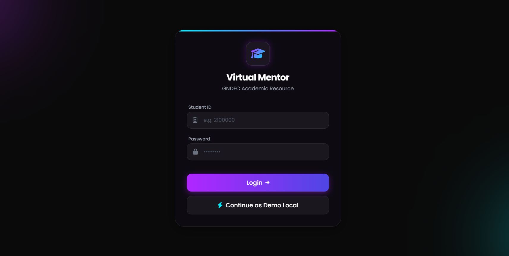
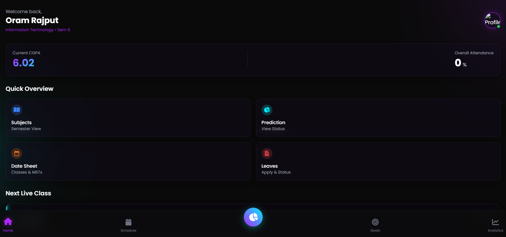
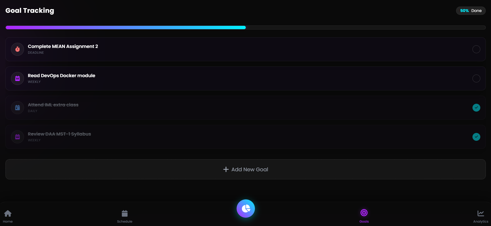
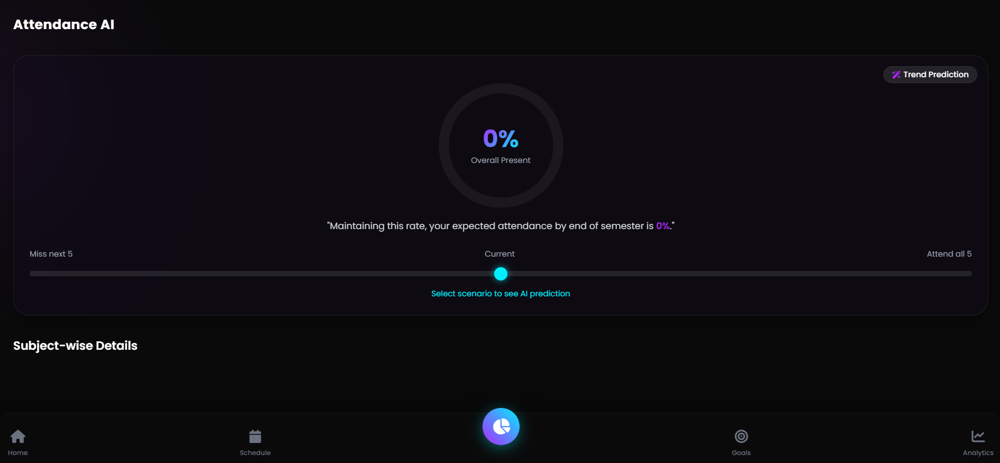
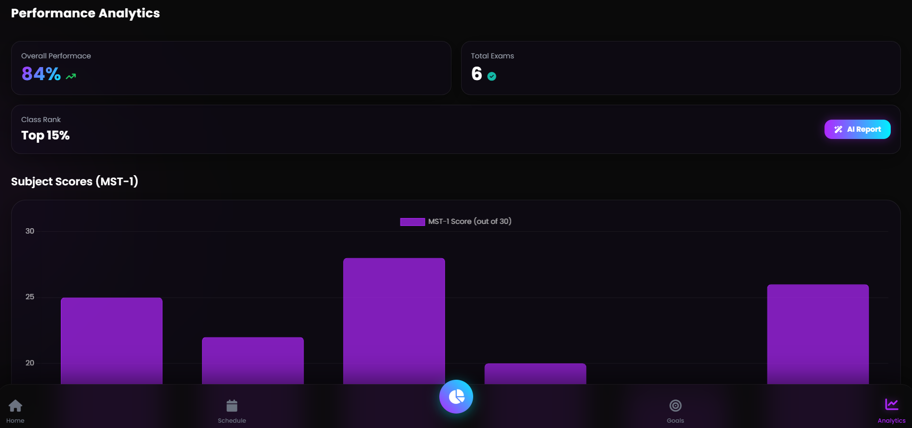
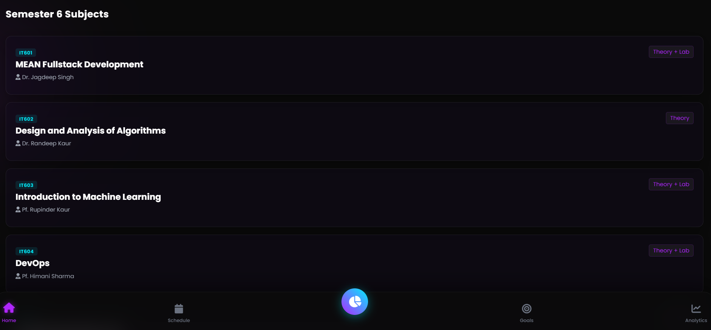
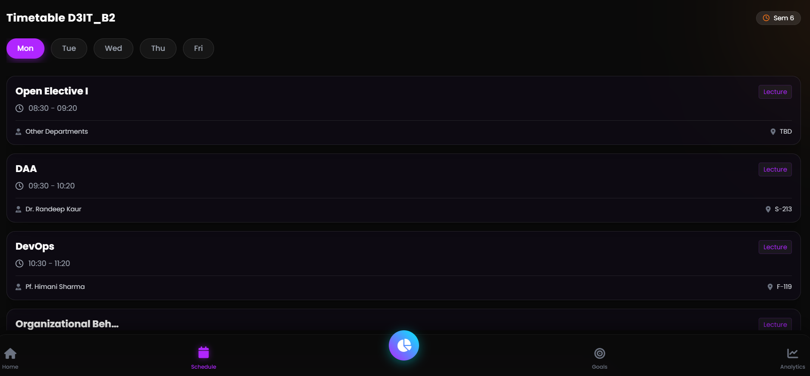

# AI-Based Virtual Academic Mentor System

Minor Project for Guru Nanak Dev Engineering College.

## Team
- Oram
- Gaurav Sood
- Sumit Kumar

Supervisor: Pf. Palwinder Kaur

## Description
This project is a mobile-first academic support system designed for GNDEC students.

It helps students:
- manage academic goals
- view timetable
- track attendance
- access LMS resources
- analyze academic performance
- generate AI-based study reports

## Tech Stack

Frontend:
- HTML
- TailwindCSS
- JavaScript

Backend:
- Node.js
- Express.js

Database:
- MongoDB

AI:
- AI APIs for study report generation

## Features

- Dark themed student dashboard
- Timetable viewer
- Attendance prediction
- LMS with syllabus and notes
- Performance analytics
- Goal tracking
- AI study report generation

## Screenshots

### Login Page

### Home Page

### Goals 

### Attendance Prediction

### Performance

### Performance SGPA

### Subjects

### Timetable 

## System Architecture

Frontend  
HTML + TailwindCSS + JavaScript  

Backend  
Node.js + Express.js  

Database  
MongoDB  

AI Layer  
AI APIs for academic report generation

## Future Scope

- Mobile application version
- Integration with official GNDEC student portal
- Automated attendance syncing
- Personalized AI study planning
- Faculty dashboard
